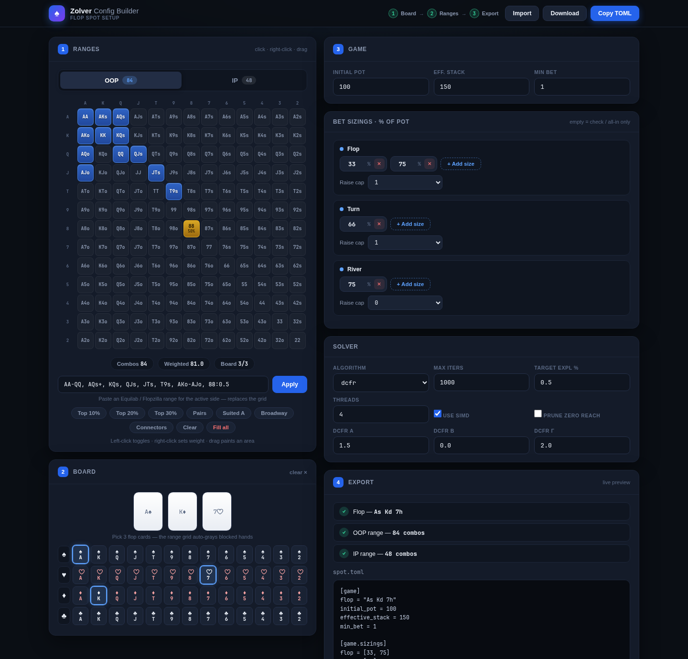
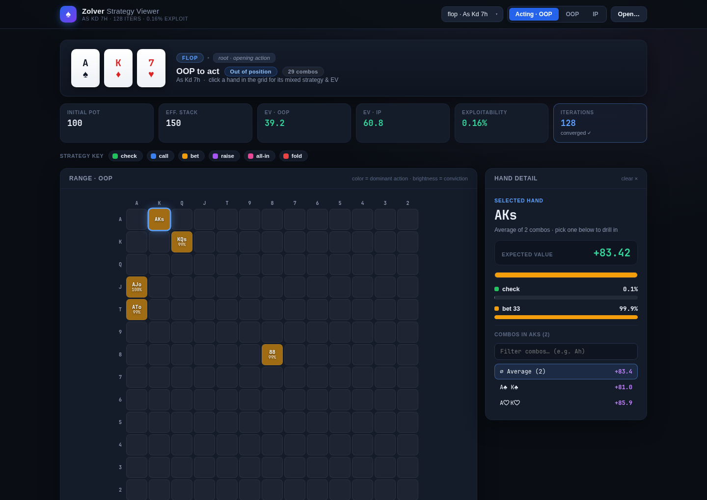
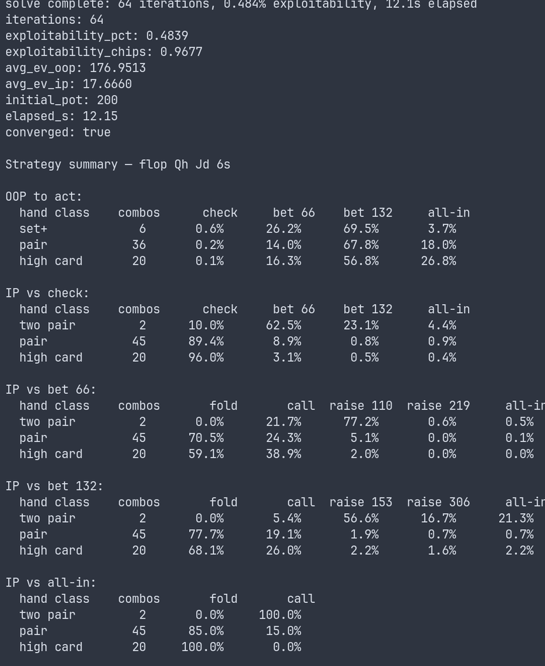

# ♠ Zolver — a free, open-source GTO poker solver

**A heads-up post-flop Texas Hold'em solver written in Zig.** Computes
approximate Nash-equilibrium strategies on your own laptop — no subscription,
no cloud, no bloat. A config file and a terminal are all you need.


```text
$ zolver solve spot.toml --summary

Strategy summary — flop As Kd 7h

OOP to act:
  hand class    combos      check      bet 5     all-in
  two pair         2      94.6%       4.7%       0.7%
  pair             6      97.5%       1.8%       0.7%

IP vs check:
  hand class    combos      check      bet 5     all-in
  pair             6       9.3%      73.2%      17.5%
  high card        4       5.8%      48.9%      45.3%
```

---

## What is this?

Zolver is a **CFR (Counterfactual Regret Minimization) solver** for heads-up
Texas Hold'em. Give it two players' ranges, a flop, stack sizes, and a betting
structure, and it finds the game-theoretically optimal way to play the rest of
the hand — then tells you, per hand, exactly how often to check, bet, call, or
fold.

It's a **serious study tool** for players who want to understand GTO (game
theory optimal) strategy. It is not a poker bot or a real-time assistant.

## Why use it?

- 🆓 **Free and open source.** Commercial solvers cost hundreds of dollars. This costs nothing.
- 💻 **Runs on consumer hardware.** Designed for laptops and desktops, not server racks.
- 🎯 **Exact, no abstraction.** Solves the full game tree — no card bucketing that blurs the answer.
- ⚡ **Fast.** Multi-threaded and SIMD-accelerated, with complete physical runout traversal.
- 🔁 **Deterministic.** Byte-for-byte identical results regardless of thread count.
- 📊 **Actually usable output.** Human-readable terminal summaries *and* machine-readable JSON.

## Features

- **Post-flop solving** from any flop, turn, or river state
- **Discounted CFR (DCFR)** and CFR+ algorithms
- **Interactive web UI** — visual config builder (range grid + card picker) and strategy viewer (per-hand grid with game tree navigation)
- **Standard range formats** — `QQ+`, `ATs+`, `A5s-A2s`, `JTs-87s`, weights, just like Equilab/Flopzilla
- **Human-readable summaries** (`--summary`) — see your strategy by hand class at a glance
- **JSON output** — per-street strategy grids + per-hand EVs for any runout
- **Helpful error messages** — `spot.toml:3: expected integer for 'game.initial_pot', got 'abc'`
- **Exploitability measurement** — know exactly how close to Nash equilibrium you are
- **Convergence stopping** — halts once exploitability hits your target, or automatically when it plateaus at the precision floor (no wasted iterations)
- **Physical runouts** — evaluates every turn/river runout with private-card-aware blocking

## Quick Start

First build the binary (see [Installation](#installation)), then alias it for
convenience:

```bash
zig build -Doptimize=ReleaseFast
alias zolver=./zig-out/bin/zolver
```

**The fast path — no text editor needed:**

```bash
# 1. Build your spot in the browser: pick a flop, draw both ranges, set sizings
zolver config                       # interactive range grid + card picker
#    → export to spot.toml when done

# 2. Solve it, then explore the result visually
zolver solve spot.toml -o results.json --summary
zolver view results.json            # interactive strategy viewer in the browser
```

**Prefer the terminal?** Start from a documented example and edit it by hand:

```bash
zolver example --output spot.toml   # writes a fully-commented config
$EDITOR spot.toml
zolver solve spot.toml --summary
```

Running `zolver` with no arguments opens the config builder automatically.

## Screenshots

| Config Builder | Strategy Viewer |
|----------------|-----------------|
|  |  |



## Installation

### Build from source

Requires **Zig 0.16.0** on **Linux** (see [Limitations](#limitations) — the
thread pool uses a Linux futex, so macOS/Windows are not supported).

```bash
git clone https://github.com/phagmaier/zolver.git
cd zolver
zig build -Doptimize=ReleaseFast
./zig-out/bin/zolver example
```

Prebuilt Linux binaries (x86_64 and aarch64) are attached to each
[release](https://github.com/phagmaier/zolver/releases).

## CLI Reference

### `zolver solve <config.toml> [flags]`

Loads a config, runs the solver until convergence or `max_iterations`, and
reports results. Flags:

| Flag | Effect |
|------|--------|
| `--summary` | Print a human-readable flop strategy overview to the terminal. |
| `--output <path>` / `-o <path>` | Write the full strategy tree as JSON. |
| `--turn <card>` | Also include the turn subtree for that runout, e.g. `--turn 2c`. |
| `--river <card>` | Also include the river subtree (requires `--turn`), e.g. `--river Ah`. |
| `--all-runouts` | Dump *every* canonical turn/river runout (large; per-hand EVs omitted). |

Progress is printed to **stderr** as it solves:

```text
loaded 'spot.toml'
  ranges: 150/180 combos  tree: 142 actions, 198 terminals  runouts: 49 turns, 2352 rivers
  memory: 45.2 MB  threads: 4
solving...
  start  exploitability: 18.234% (18.234 chips)
  iter     64  exploitability:  1.853% (1.853 chips)  4.7s
  iter    128  exploitability:  0.487% (0.487 chips)  9.5s
solve complete: 128 iterations, 0.487% exploitability, 9.5s elapsed
```

A compact run summary is printed to **stdout**:

```text
iterations: 128
exploitability_pct: 0.487
exploitability_chips: 0.487
avg_ev_oop: 48.32
avg_ev_ip: 51.68
initial_pot: 100
elapsed_s: 9.52
converged: true
```

> **Note on EVs:** after normalization by compatible range mass,
> `avg_ev_oop` and `avg_ev_ip` sum to `initial_pot`, including when a line ends
> all-in before the river. Turn and river chance is conditioned on the four
> dealt private cards: 45 cards to a flop turn, then 44 to a river.

### `zolver view <results.json>`

Opens an **interactive strategy viewer** in your browser.

**How to use it:**

- The 13×13 grid shows the acting player's range. Each cell is color-coded by
  what the strategy does with that hand — green = check, orange = bet, red =
  fold, purple = raise, pink = all-in. Brighter = higher probability.
- **Click any cell** to see the exact strategy breakdown and EV for that
  specific hand in the detail panel on the right.
- **Click the action buttons** below the grid (\"bet 66\", \"raise 110\", etc.)
  to navigate deeper into the game tree and see how the opponent responds.
- Use the **player toggle** (OOP / IP / Acting) to view the other player's
  perspective at the same decision point.
- If you solved with `--turn` or `--all-runouts`, use the **street dropdown**
  to switch between flop, turn, and river.
- **Keyboard shortcuts:** `Backspace` goes back up the tree, `Escape` deselects
  the current hand, arrow keys switch streets.
- The viewer also works **standalone** — open the HTML file directly and
  drag-and-drop any `results.json` onto it.

### `zolver config`

Opens an **interactive config builder** in your browser. Build a complete
spot without touching a text editor.

**How to build a spot, step by step:**

1. **Pick the flop** — click three cards from the 52-card deck at the top of
   the right panel. The selected cards appear in the board slots. The range
   grid automatically grays out hands that share cards with the board.

2. **Set OOP's range** — in the left panel (\"OOP Range\" tab):
   - **Left-click** a cell to include that hand in the range (blue highlight).
     Click again to remove it.
   - **Right-click** a cell to open a weight slider — set the hand to 75%, 50%,
     or 25% frequency. Partially-weighted hands show a yellow tint with the
     percentage in the cell. Click **Apply** to confirm or **Cancel** to discard.
   - **Click and drag** across multiple cells to select or deselect a region
     of hands at once.
   - Use the **preset buttons** (\"All Pairs\", \"Suited Aces\", \"Top 20%\",
     etc.) to quickly populate common ranges. Presets replace the current
     selection.

3. **Set IP's range** — switch to the \"IP Range\" tab and repeat. The two
   ranges are independent.

4. **Configure the game** — in the right panel:
   - Set **Initial Pot**, **Effective Stack**, and **Min Bet**.
   - Add or remove **bet sizings** per street (as percentages of the pot).
     Click **+ Add** to add a sizing, the × button to remove one.
   - Set **raise caps** per street (\"none\" = unlimited raising).

5. **Configure the solver** — algorithm, max iterations, target exploitability,
   thread count, SIMD, prune options, and DCFR parameters (hidden when
   CFR+ is selected).

6. **Export** — the **TOML Preview** panel updates live as you edit. Click
   **Copy to Clipboard** or **Download spot.toml**, then run:
   `zolver solve spot.toml -o results.json`

### `zolver example [--output <path>]`

Prints a fully-documented example config to stdout (or to a file).

### `zolver help`

Prints usage.

## Output formats

### `--summary` (terminal)

A range-weighted breakdown of the strategy at the key flop decision points —
OOP's opening action and IP's responses — grouped by made-hand class on the
flop (`set+`, `two pair`, `pair`, `high card`). Perfect for a quick read of
"what should I do with this kind of hand here?"

### `--output results.json` (machine-readable)

The full per-hand strategy tree, ready to feed into a script, notebook, or your
own viewer. The flop tree (runout-independent) is always included; turn/river
subtrees are added on demand with `--turn`/`--river`, or exhaustively with
`--all-runouts`.

```jsonc
{
  "meta": {
    "flop": "As Kd 7h", "initial_pot": 100, "effective_stack": 200,
    "iterations": 128, "exploitability_pct": 0.487,
    "ev_oop": 48.32, "ev_ip": 51.68, "converged": true
  },
  "streets": [
    {
      "street": "flop", "board": "As Kd 7h",
      "nodes": [
        {
          "id": 87, "player": "oop", "line": [],
          "actions": ["check", "bet 50", "all-in"],
          "hands": [
            { "combo": "AhKh", "strategy": [0.05, 0.40, 0.55], "ev": 142.3 }
          ]
        }
      ]
    }
  ]
}
```

`strategy` lines up positionally with `actions`; `line` is the action path from
the root to that node. Bet/raise amounts are in chips.

## Config File Reference

The config uses a TOML-like format. Sections and keys are required unless marked
optional. Bad configs report the exact line and reason, e.g.
`spot.toml:3: expected integer for 'game.initial_pot', got 'abc'`.

### `[game]`

| Key | Type | Description |
|-----|------|-------------|
| `flop` | string | Three flop cards, space-separated. Format: rank + suit (`As Kd 7h`). Ranks: 2-9, T, J, Q, K, A. Suits: s, h, d, c. |
| `initial_pot` | integer | Pot size (in chips) at the start of flop betting. |
| `effective_stack` | integer | The smaller of the two remaining postflop stacks. |
| `min_bet` | integer | Minimum bet/raise increment in chips. *Optional, default: 1.* |
| `max_budget_bytes` | integer | Total retained solver-memory limit before a solve starts: tables, storage, and thread-dependent working arenas. *Optional, default: 8 GB.* Increase for large trees with many sizings/raises; lower to avoid excessive swap on low-memory machines. |
| `compress_suits` | boolean | Solve using canonical suit-isomorphic turn/river runouts while exactly remapping private-hand reaches and values. *Optional, default: true.* Set `false` only to use the full physical-runout correctness oracle. |

### `[game.sizings]`

Bet size fractions as percentages of the pot, per street. An empty list `[]`
means only check and all-in are available. Values must be strictly increasing
per street.

| Key | Type | Description |
|-----|------|-------------|
| `flop` | integer array | Bet sizes on the flop (e.g., `[25, 50, 75]` for 25%, 50%, 75% of pot). |
| `turn` | integer array | Bet sizes on the turn. |
| `river` | integer array | Bet sizes on the river. |

### `[game.raise_cap]`

Maximum number of raises per street. Use `none` or `unlimited` (or omit the key)
for no cap. Use `0` to disallow raises (check/call/fold only).

| Key | Type | Description |
|-----|------|-------------|
| `flop` | integer or `none` | Max raises on the flop. |
| `turn` | integer or `none` | Max raises on the turn. |
| `river` | integer or `none` | Max raises on the river. |

### `[ranges]`

Player hand ranges with frequencies. Format: `HAND[SUFFIX][:WEIGHT]`,
comma-separated. The same notation Equilab and Flopzilla export.

**Single hands:**
- `AK` — all 16 combos (suited + offsuit)
- `AKs` — suited only (4 combos)
- `AKo` — offsuit only (12 combos)
- `88` — pocket pair (6 combos; suffix ignored for pairs)

**Plus ranges:**
- `QQ+` → QQ, KK, AA
- `ATs+` → ATs, AJs, AQs, AKs *(ace fixed, kicker climbs)*
- `T9s+` → T9s, JTs, QJs, KQs, AKs *(gap preserved, climbs to ace)*

**Dash ranges:**
- `99-66` → 99, 88, 77, 66
- `A5s-A2s` → A5s, A4s, A3s, A2s
- `JTs-87s` → JTs, T9s, 98s, 87s

**Weights:** append `:VALUE` (0.0–1.0) to play a hand a fraction of the time.
Default is `1.0`. Applies to plus/dash ranges too (`QQ+:0.5`).

| Key | Type | Description |
|-----|------|-------------|
| `oop` | string | Out-of-position player's preflop range. |
| `ip` | string | In-position player's preflop range. |

**Examples:**
```toml
oop = "QQ+, AKs, AQs+, AJo+, T9s+, 88:0.5"
ip  = "JJ+, AKs, KQs, A5s-A2s:0.5"
```

### `[solver]`

| Key | Type | Default | Description |
|-----|------|---------|-------------|
| `algorithm` | string | — | `"dcfr"` (recommended) or `"cfr_plus"`. |
| `max_iterations` | integer | `1000` | Hard cap on solve iterations. |
| `target_exploitability_pct` | float | `0.5` | Stop when exploitability reaches this % of the initial pot. |
| `num_threads` | integer | `0` | Worker threads. `0` = serial. `4` = 3 workers + main thread. |
| `prune_zero_reach` | boolean | `false` | Skip subtrees where the opponent has zero probability mass. Safe to enable. |
| `use_simd` | boolean | `true` | Use SIMD vectorized kernels (8-wide f32). Recommended. |
| `check_interval` | integer | `64` | Exploitability re-check cadence after iterations 32, 64, 128. |
| `stall_patience` | integer | `5` | Stop early after this many exploitability checks with no real improvement (the solve has hit the precision floor). `0` disables. |
| `stall_rel_improvement` | float | `0.01` | Minimum fractional drop in exploitability that counts as progress for `stall_patience`. |
| `debug_invariants` | boolean | `true` (Debug) | Run NaN/Inf scans of regret arrays after every pass. |

### `[solver.dcfr]`

DCFR discounting parameters. Only used when `algorithm = "dcfr"`.

| Key | Type | Default | Description |
|-----|------|---------|-------------|
| `alpha` | float | `1.5` | Discount exponent for positive regrets. |
| `beta` | float | `0.0` | Discount exponent for negative regrets. |
| `gamma` | float | `2.0` | Strategy averaging weight exponent. |

### Complete example

```toml
[game]
flop = "As Kd 7h"
initial_pot = 100
effective_stack = 200
min_bet = 1
max_budget_bytes = 8589934592  # 8 GB — increase for large trees
compress_suits = true          # Set false only for physical-runout oracle checks

[game.sizings]
flop = [25, 50, 75]
turn = [25, 50]
river = [50, 100]

[game.raise_cap]
flop = 1
turn = none
river = 1

[ranges]
oop = "QQ+, AKs, AQs+, AJo+, T9s+, 88:0.5"
ip  = "JJ+, AKs, KQs, A5s-A2s:0.5"

[solver]
algorithm = "dcfr"
max_iterations = 1000
target_exploitability_pct = 0.5
num_threads = 4
prune_zero_reach = true
stall_patience = 5            # stop early once exploitability plateaus (0 = off)
stall_rel_improvement = 0.01

[solver.dcfr]
alpha = 1.5
beta = 0.0
gamma = 2.0
```

## How It Works

### Algorithm

Zolver uses **Discounted CFR (DCFR)** with parameters α=1.5, β=0, γ=2 — the
configuration recommended by Brown & Sandholm (2019) for fastest convergence in
large games. Each iteration, one player updates their regrets while the opponent
plays their current strategy, then the roles swap. Strategies are extracted from
accumulated positive regrets via regret matching.

### Game tree

The tree is built from the betting structure you specify. Action nodes branch on
every legal action (check, fold, call, bet, raise, all-in); chance nodes deal the
turn and river; terminal nodes are folds or showdowns.

### Suit isomorphism

By default (`compress_suits = true`) the solver collapses suit-symmetric
turn/river runouts into canonical representatives, exactly remapping each
player's private-hand reaches and returned values for every orbit member — so
board-blocking semantics are preserved and the result matches the full physical
traversal. This is where the memory savings on symmetric boards come from
(monotone flops shrink the runout tables ~71%). Set `compress_suits = false` to
evaluate the complete physical 49×48 space directly as a correctness oracle;
rainbow flops have no board symmetry, so the two modes coincide there.

### Exploitability

Exploitability measures how far a strategy is from Nash equilibrium, in chips per
hand and as a percentage of the initial pot. Lower is stronger. The solver stops
automatically once it drops below `target_exploitability_pct`.

## Performance

The end-to-end baseline below was measured on Linux with 8 solver threads,
`ReleaseFast`, DCFR with α=1.5, β=0, γ=2, at commit `669702c`. Each result is
the median of three 128-iteration runs after one warm-up. Every spot traverses
all 49 turns and 2,352 ordered turn-river runouts; memory is total retained
solver memory plus thread-dependent working arenas.

### Kernel throughput (bench.zig micro-benchmarks)

| Kernel | Scalar | SIMD | Speedup |
|--------|--------|------|---------|
| Regret matching | 1,005 Mslots/s | 11,504 Mslots/s | 11.5× |
| DCFR regret update | 2,757 Mslots/s | 12,939 Mslots/s | 4.7× |
| Strategy accumulation | 1,727 Mslots/s | 10,570 Mslots/s | 6.1× |
| Showdown sweep | — | — | 319 Mhands/s |

### End-to-end physical-runout baseline (8 threads, 128 forced iterations)

| Spot | Tree | Total memory | ms/iter | Exploitability @128 |
|------|------|--------------|---------|----------------------|
| SRP dry (rainbow) | 288A / 389T | 764.6 MB | 271 | 1.2902% |
| SRP two-tone | 288A / 389T | 764.6 MB | 296 | 0.7528% |
| SRP monotone | 288A / 389T | 764.6 MB | 295 | 0.9446% |
| 3-bet dry | 204A / 269T | 346.9 MB | 127 | 0.7857% |
| SRP, three sizings | 1,108A / 1,613T | 3,611.4 MB | 1,267 | 2.3985% |
| SRP, raise cap 2/1/1 | 372A / 493T | 920.1 MB | 357 | 1.6058% |

These are the **physical-oracle** numbers (`compress_suits = false`), so texture
does not change runout-table size or total memory — the matched rainbow,
two-tone, and monotone spots all traverse the complete physical chance space, and
their small runtime difference is board-specific evaluation work. With the
default `compress_suits = true`, symmetric boards shrink dramatically (two-tone
466.2 MB, monotone 221.9 MB) while rainbow is unchanged. Extra bet sizes remain
the dominant capacity lever. Memory and exploitability match the pre
spin-then-park baseline; wall ms/iter is at least as fast.

A separate **thread-pool characterization** (wall + CPU time per phase at
1/2/4/8 threads) lives in [`bench/README.md`](bench/README.md): the solve
iteration still pins ~7.9 cores and scales ~6× on 8 threads, while the adaptive
**spin-then-park** pool drops exploit/output `cores_busy` from ~8.0 toward
~1–2 (workers park during serial work instead of burning cores).

## Limitations

- **Linux only.** The thread pool parks idle workers on a raw Linux futex (a
  deliberate trade-off to keep the pool allocation-only — see
  [`src/threading.zig`](src/threading.zig)), so the code does not build on
  macOS or Windows.
- **Heads-up only.** Multi-way pots are not supported.
- **Post-flop only.** The solver always begins at the flop; preflop solving is out of scope.
- **No abstraction.** It solves the full game tree with no card bucketing — exact, but the tree can grow large with many bet sizes.
- **~0.2% exploitability floor.** Regret/strategy storage is `f32`, which keeps
  memory light but caps how close to Nash a solve can get (~0.2% of pot for
  DCFR). Convergence is fast to that floor; the solver then stops automatically
  rather than spinning. This is within the range commercial solvers are commonly
  run to. See [`bench/README.md`](bench/README.md#convergence-characteristics-speed-vs-accuracy-floor).

## Project Status

The solver is **complete and tested (238 tests)** — from tree construction
through threaded DCFR, best response, exploitability, SIMD kernels, output
extraction, JSON export, interactive web UI (config builder + strategy viewer),
and human-readable summaries. Convergence is cross-validated against TexasSolver
(see [`bench/`](bench/README.md)). See
[`AGENTS.md`](AGENTS.md) for detailed implementation notes.

## Building

Requires **Zig 0.16.0**. The project is a single Zig package (`build.zig`)
exposing several steps, plus a few standalone measurement binaries and helper
scripts.

### Build steps (`zig build <step>`)

| Step | Command | Purpose |
|------|---------|---------|
| *(default)* | `zig build` | Debug build → `zig-out/bin/zolver` (assertions + `debug_invariants` NaN/Inf sweeps enabled). |
| *(default, release)* | `zig build -Doptimize=ReleaseFast` | Optimized build — use this for anything you actually run or time. |
| `run` | `zig build run -- solve spot.toml --summary` | Build and launch the CLI; everything after `--` is forwarded to `zolver`. |
| `test` | `zig build test` | Full test suite (238 tests: unit, suit-compression parity, serial-vs-threaded determinism, spin-then-park pool). |
| `bench-threads` | `zig build bench-threads -- <spot.toml> [flags]` | Thread-pool benchmark: wall **and** CPU time for the solve / exploitability / output passes at 1/2/4/8 threads. Always compiles ReleaseFast. Flags: `--iters N --warmup N --exploit-reps N --output-reps N`. Prints JSON to stdout, a table to stderr. |

### Standalone measurement binaries (`zig run`)

These time work rather than assert; they're intentionally excluded from `zig build test`.

| Command | Purpose |
|---------|---------|
| `zig run -OReleaseFast src/bench.zig` | Kernel microbenchmarks (regret matching, DCFR update, strategy accumulation, showdown sweep) plus one full CFR iteration with a memory-bandwidth figure. |
| `PERF_ITERS=40 PERF_THREADS=8 zig run -OReleaseFast src/perf_profile.zig` | Runs *only* the solve hot path in a tight loop, for profiling under `perf record --call-graph dwarf`. |

### Benchmark & validation scripts (`bench/`)

| Command | Purpose |
|---------|---------|
| `python3 bench/run_bench.py [spot.toml ...]` | End-to-end solve benchmark over `bench/spots/` → `bench/out/results.md` + JSON. One warm-up + three median samples; asserts the full 49-turn / 2,352-runout space. |
| `bench/run_thread_bench.sh [spot.toml ...]` | Runs `bench-threads` across the texture spots → `bench/out/threads/` (+ a combined `summary.md`). |
| `TEXASSOLVER_DIR=/path/to/TexasSolver bench/run_validation.sh v1 v1b v2` | Cross-validates flop strategies against TexasSolver v0.2.0. |

See [`bench/README.md`](bench/README.md) for methodology, results, and how the
harness has caught real bugs.

## License

MIT — see [LICENSE](LICENSE) for details.

## Acknowledgments

This project draws on the academic literature on CFR and its variants:

- Zinkevich et al. (2008) — Regret minimization in games
- Brown & Sandholm (2019) — Discounted CFR
- Tammelin (2014) — CFR+
- Johanson et al. (2012) — Suit isomorphism for poker
```
